# SOFuzz: Deep Architectural Specification

This document provides a highly detailed, low-level technical breakdown of the SOFuzz structural architecture. Designed for Master's-level academic analysis, it explicitly covers System Sequence Execution, Object/Class interactions, and the Low-Level algorithms driving the Fuzzing/Constraint Engines.

---

## 1. System Sequence Diagram (Execution Flow)

The following sequence diagram outlines the exact orchestration lifecycle when SOFuzz analyzes and fuzzes an Android Application.

```mermaid
sequenceDiagram
    autonumber
    actor Analyst
    participant SOF[SOFuzz Main Pipeline]
    participant Ext[APKExtractor]
    participant ST[Static Analyzer & CallGraph]
    participant SG[Seed Generator]
    participant HG[Harness Generator]
    participant AFL[AFL++ Showmap Evolver]
    participant Crash[Triage & GDB Engine]

    Analyst->>SOF: sofuzz --apk target.apk

    %% Extraction
    rect rgb(30, 30, 30)
    SOF->>Ext: Extract and identify Architectures
    Ext-->>SOF: Return unzipped .so paths & Fingerprint JSON
    end

    %% Static Analysis
    rect rgb(30, 50, 60)
    SOF->>ST: Pass libnative.so
    ST->>ST: Disassemble .text via Capstone
    ST->>ST: Build NetworkX DiGraph
    ST->>ST: Backward Path Slice (malloc -> JNI_process)
    ST-->>SOF: Return Fuzzable Functions List (FunctionInfo)
    end

    %% Seed Generation
    rect rgb(50, 40, 30)
    SOF->>SG: Run Seed Generator
    SG->>SG: Scan .rodata for ASCII formats
    SG-->>SOF: Return sofuzz.dict and raw_seeds
    end

    %% Harness Generation
    rect rgb(20, 60, 20)
    SOF->>HG: Issue Generate Request
    HG->>HG: Analyze Constraints (is it "password"?)
    alt Constraint Triggers
        HG->>HG: Wrap HARNESS_STRUCTURED_TEMPLATE
    else Multiple JNI Found
        HG->>HG: Wrap HARNESS_SEQ_TEMPLATE
    end
    HG-->>SOF: Compile harness_sequence.c -> binary
    end

    %% Fuzz Execution Loop
    rect rgb(60, 20, 20)
    SOF->>AFL: Execute Compiled Harness with Initial Seeds
    loop AFL Edge Tracking
        AFL->>AFL: Custom Python Mutator hooks buffer[256:300]
        
        alt 0% New Coverage Discovered
            AFL-->>HG: Issue [PRUNE] Genetic Signal
            HG->>HG: Dynamically rewrite C-Harness constraints
        else Segmentation Fault Detected
            AFL-->>Crash: Pass core dump / stderr context
        end
    end
    end

    %% Triage Analysis
    rect rgb(50, 20, 60)
    Crash->>Crash: Isolate Root-Cause Frame Address
    Crash->>Crash: Generate repro.gdb Replay Script
    Crash-->>Analyst: Present report.json & GDB Exploit
    end
```



---

## 2. Core Subsystems & Deep Algorithmic Flow

### A. Capstone CallGraph & Backward Path Slicing
*Located in: `sofuzz/analyzer/call_graph.py`*

Instead of utilizing heavy symbolic execution engines that trace Java VM contexts, SOFuzz implements a highly optimized NetworkX/Capstone combination.
1. **Instruction Parsing**: Capstone disassembles the `.text` segment instruction-by-instruction.
2. **Branch Mapping**: Explicitly maps X86 `call` and ARM `bl` instructions pointing to function tables (`symbol_extractor.py`).
3. **Graphing**: Nodes represent functions, and Edges represent hardcoded instruction jumps. 
4. **Slicing**: By querying `nx.has_path(graph, Java_Interface, alloc_sink)`, the system instantly determines exactly which Java wrappers touch corruptible sinks, eliminating 90% of "safe" native code from the attack surface. 
5. **Bidirectional Feedback**: It explicitly scans for `CallObjectMethod` and `CallVirtualMethod` identifiers returning to Dalvik, exposing highly complex "C++ executing Android" callback logic.

### B. Intelligent Seed Generation & Dictionary Linking
*Located in: `scripts/seed_generator.py`*

The system mathematically guarantees initial JNI structure validation bypasses by deriving seeds manually from the binary's DNA.
- **Rule**: Analyzes purely the `.rodata` block of the ELF binary, avoiding dynamically heap-allocated segments.
- **Extraction**: Trims obvious compiler artifacts (`GCC`, `GLIBC`) and pulls raw `char*` equivalents. 
- **Application**: Dumps them into a unified `.dict` file. When the execution Engine encounters `strcmp()`, the seed array natively forces AFL to use those exact derived passwords, drastically improving State 0 coverage metrics.

### C. The Constraint Engine & Structure-Aware Code Generation
*Located in: `sofuzz/harness/generator.py`*

Standard fuzzers fail at JNI bounds because they blindly mutate random length buffers resulting in `NullPointerExceptions` at offset `0x0`. SOFuzz generates C code autonomously:
1. **Sequence Hashing**: If `jni_func[A]` and `jni_func[B]` both exist within the `.so`, SOFuzz builds a `harness_sequence_combo.c` executing both linearly, attempting to desync the target state-machine natively.
2. **Structure-Aware Fuzzing**: Rather than fuzzing `<buffer>`, `HARNESS_STRUCTURED_TEMPLATE` natively partitions the payload in C:
    ```c
    char* array_arg = (char*)buffer;               // Bytes 0-255 
    char* path_arg  = (char*)(buffer + 256);       // Bytes 256-300 
    jint* len_arg   = (jint*)(buffer + 301);       // Bytes 301-304 
    ```
    This completely eliminates data-struct parsing logic errors before the fuzzer even begins mutating.

### D. AFL++ Custom Mutator Engine
*Located in: `scripts/afl_custom_mutator.py`*

A Native python API directly hooked into `AFL_PYTHON_MODULE`.
By overriding `fuzz()`, SOFuzz forcibly locks AFL's bit-flip arrays mathematically between offsets `target_idx = random.randint(256, 300)`. This secures structural offset headers and forces AFL to strictly hunt within the allowed filepaths/strings, bypassing all serialization and header validation logic dynamically.

### E. Crash Triage Engine
*Located in: `sofuzz/crash/analyzer.py`*

1. **Signal Catching**: The `siglongjmp` mechanisms inside the C harnesses explicitly trap `SIGSEGV` and `SIGABRT`.
2. **Deterministic Scripting**: The result parses the core frames, explicitly building `repro.gdb` artifacts forcing GDB servers to autonomously execute `run < crash_report_input.bin` directly hitting the identified vulnerable PC (Program Counter) address.
