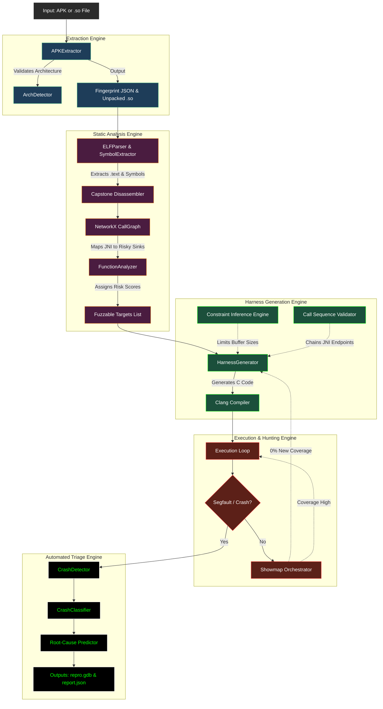

# SOFuzz : High-Level Design (HLD)

SOFuzz is architected as a highly modular, structure-aware native fuzzing pipeline. It consists of five major subsystems working synchronously to autonomously discover memory corruption vulnerabilities within Android natively compiled libraries (`.so` files).

## 1. System Architecture Diagram

## 2. Core Component Breakdown

### I. The Extraction Engine (`sofuzz/extractor/`)
**Purpose:** Handles the raw inputs safely.
- **`APKExtractor`**: Unzips Android targets, isolates the compiled C/C++ libraries, and bypasses Java noise.
- **`Native Fingerprinting`**: Automatically scans over the components and creates a JSON schema of exposed targets and JNI dependencies.

### II. Static Analysis Engine (`sofuzz/analyzer/`)
**Purpose:** Provides the fuzzer with "X-Ray Vision" so it does not operate blindly.
- **`ELFParser` & `SymbolExtractor`**: Locates boundaries, symbol names, and the executable `.text` segment.
- **`CallGraph`**: Uses the **Capstone Engine** to statically disassemble ARM/x86 logic. Passes instruction edges into **NetworkX** to create a mathematical Directed Graph of the binary structure.
- **`Backward Path Slicing`**: Traces specific paths from dangerous memory operations (like `strcpy`) backwards to discover identical entry points (like `Java_*`).

### III. Harness Generation Engine (`sofuzz/harness/`)
**Purpose:** The intelligent compiler wrapper.
- **`HarnessGenerator`**: Ingests the analyzed risk logic and physically writes `C` programming environments around the broken functions.
- **`Constraint Inference`**: Mutates logic so passwords or simple strings are strictly capped (e.g. 14-32 bytes) preventing fake constraints/crashes.
- **`Sequence validation`**: Dynamically crafts large `sequence_combo.c` files that wrap multiple independent JNI functions together to find deeper state-machine bugs.

### IV. Execution & Hunting Engine (`scripts/`)
**Purpose:** Orchestrates the runtime payload deployments.
- Continuously executes the deployed `C` harnesses fed with data.
- **`Coverage-Guided Evolution`**: The `showmap_orchestrator.py` dynamically interfaces with AFL tooling. If a harness yields 0% new explorations (coverage), the orchestrator automatically prunes the test, dynamically saving processing bandwidth.

### V. Automated Triage Engine (`sofuzz/crash/`)
**Purpose:** Turns the discovery into an actionable research report.
- **`CrashAnalyzer`**: Intercepts generic `STDERR` signals.
- Parses and cleans standard outputs to predict the exact failing assembly instruction (**Root Cause Engine**).
- Dumps interactive **GDB Deterministic Replay scripts** enabling security researchers directly hit the verified exploit in a debugger immediately.
